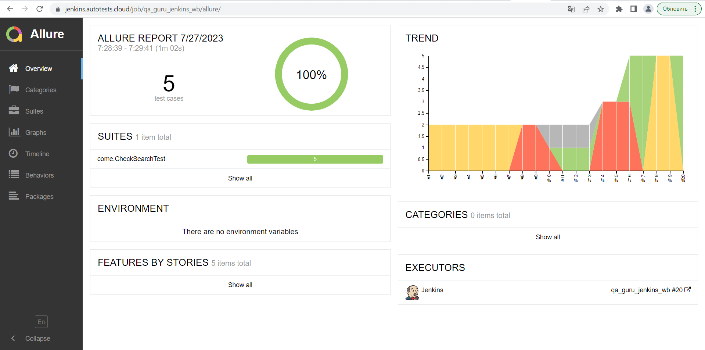
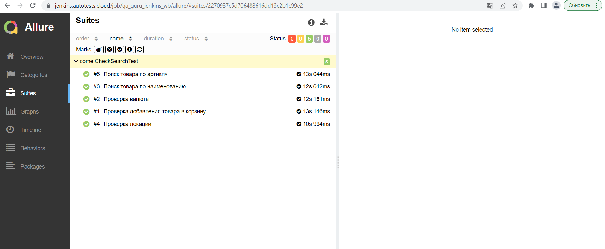
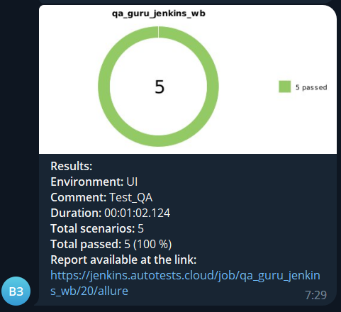

# Проект по автоматизации тестирования www.wildberries.ru

### Технологии и инструменты:
<p align="center">


</p>

### Реализованные проверки:
* Поиск товара по артикулу
* Поиск товара по наименованию
* Проверка добавнения товара в корзину
* Проверка валюты
* Проверка локации


#### Удаленный запуск тестов с параметрами:

```bash
gradle clean ui_test
-Dbrowser=${BROWSER}
-DbrowserVersion=${BROWSER_VERSION}
-DbrowserSize=${BROWSER_SIZE}
-DremoteDriverUrl=https://${REMOTE_DRIVER_URL}/wd/hub/
```
где:

- <code>BROWSER</code> – браузер, в котором будут выполняться тесты.
- <code>BROWSER_VERSION</code> – версия браузера, в которой будут выполняться тесты.
- <code>BROWSER_SIZE</code> – размер окна браузера, в котором будут выполняться тесты.
- <code>REMOTE_DRIVER_URL</code> – адрес удаленного сервера, на котором будут запускаться тесты.

### Сборка в Jenkins
<p align="center">

</p>

### Отчет в Allure report
#### Основная страница отчета
<p align="center">

</p>

#### Тест-кейсы
<p align="center">

</p>

### Уведомления в Telegram с использованием бота
<p align="center">

</p>
